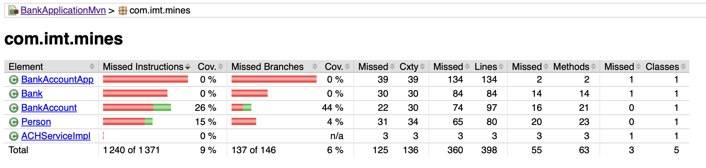
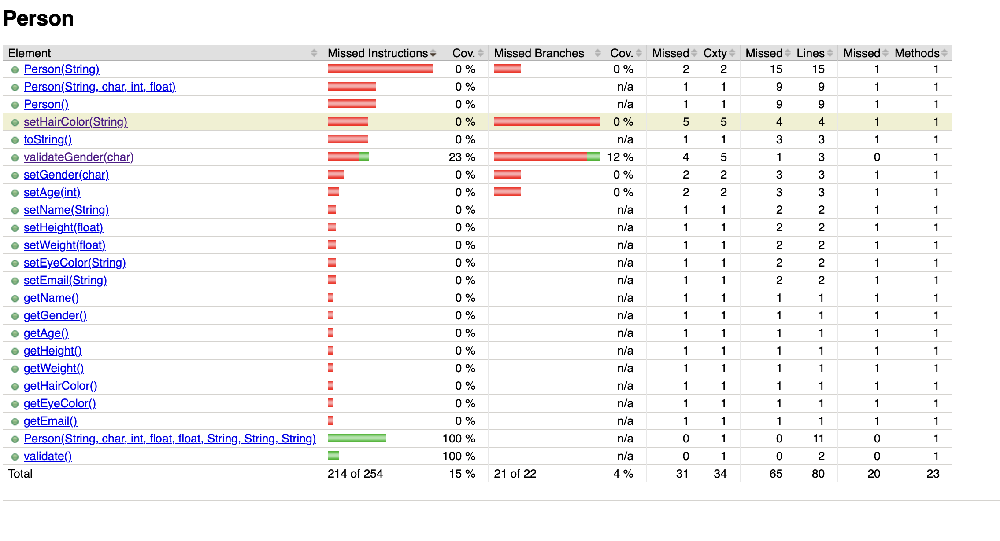
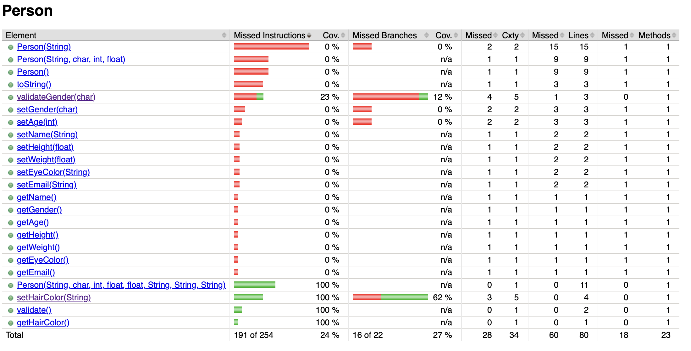

# Exercice 9

## mvn clean test

```bash
... BankApplicationMvn % mvn clean test
[INFO] Scanning for projects...
[INFO] 
[INFO] ------------------< com.imt.mines:BankApplicationMvn >------------------
[INFO] Building BankApplicationMvn 1.0-SNAPSHOT
[INFO]   from pom.xml
[INFO] --------------------------------[ jar ]---------------------------------
[INFO] 
[INFO] --- clean:3.2.0:clean (default-clean) @ BankApplicationMvn ---
[INFO] Deleting /Users/lennygonzales/Documents/cours/ales/cours/2A/Validation_des_logiciels/BankApplicationMvn/target
[INFO] 
[INFO] --- jacoco:0.8.11:prepare-agent (default) @ BankApplicationMvn ---
[INFO] argLine set to -javaagent:/Users/lennygonzales/.m2/repository/org/jacoco/org.jacoco.agent/0.8.11/org.jacoco.agent-0.8.11-runtime.jar=destfile=/Users/lennygonzales/Documents/cours/ales/cours/2A/Validation_des_logiciels/BankApplicationMvn/target/jacoco.exec
[INFO] 
[INFO] --- resources:3.3.1:resources (default-resources) @ BankApplicationMvn ---
[INFO] Copying 0 resource from src/main/resources to target/classes
[INFO] 
[INFO] --- compiler:3.13.0:compile (default-compile) @ BankApplicationMvn ---
[INFO] Recompiling the module because of changed source code.
[INFO] Compiling 6 source files with javac [debug target 21] to target/classes
[WARNING] location of system modules is not set in conjunction with -source 21
  not setting the location of system modules may lead to class files that cannot run on JDK 21
    --release 21 is recommended instead of -source 21 -target 21 because it sets the location of system modules automatically
[INFO] 
[INFO] --- resources:3.3.1:testResources (default-testResources) @ BankApplicationMvn ---
[INFO] skip non existing resourceDirectory /Users/lennygonzales/Documents/cours/ales/cours/2A/Validation_des_logiciels/BankApplicationMvn/src/test/resources
[INFO] 
[INFO] --- compiler:3.13.0:testCompile (default-testCompile) @ BankApplicationMvn ---
[INFO] Recompiling the module because of changed dependency.
[INFO] Compiling 1 source file with javac [debug target 21] to target/test-classes
[WARNING] location of system modules is not set in conjunction with -source 21
  not setting the location of system modules may lead to class files that cannot run on JDK 21
    --release 21 is recommended instead of -source 21 -target 21 because it sets the location of system modules automatically
[INFO] 
[INFO] --- surefire:3.2.5:test (default-test) @ BankApplicationMvn ---
[INFO] Using auto detected provider org.apache.maven.surefire.junitplatform.JUnitPlatformProvider
[INFO] 
[INFO] -------------------------------------------------------
[INFO]  T E S T S
[INFO] -------------------------------------------------------
[INFO] Running com.imt.mines.BankAccountTest
[INFO] Tests run: 4, Failures: 0, Errors: 0, Skipped: 0, Time elapsed: 0.030 s -- in com.imt.mines.BankAccountTest
[INFO] 
[INFO] Results:
[INFO] 
[INFO] Tests run: 4, Failures: 0, Errors: 0, Skipped: 0
[INFO] 
[INFO] 
[INFO] --- jacoco:0.8.11:report (report) @ BankApplicationMvn ---
[INFO] Loading execution data file /Users/lennygonzales/Documents/cours/ales/cours/2A/Validation_des_logiciels/BankApplicationMvn/target/jacoco.exec
[INFO] Analyzed bundle 'BankApplicationMvn' with 5 classes
[INFO] ------------------------------------------------------------------------
[INFO] BUILD SUCCESS
[INFO] ------------------------------------------------------------------------
[INFO] Total time:  1.540 s
[INFO] Finished at: 2026-01-16T09:33:42+01:00
[INFO] ------------------------------------------------------------------------
```



J'ai choisis la méthode `setHairColor` de la class **Person** :


J'ai ajouté 2 tests :
- Modification de la couleur de cheveux par "`blond`" (modification acceptée)
- Modification de la couleur de cheveux par une string vide (garde l'ancienne valeur)

```bash
... BankApplicationMvn % mvn clean test
[INFO] Scanning for projects...
[INFO] 
[INFO] ------------------< com.imt.mines:BankApplicationMvn >------------------
[INFO] Building BankApplicationMvn 1.0-SNAPSHOT
[INFO]   from pom.xml
[INFO] --------------------------------[ jar ]---------------------------------
[INFO] 
[INFO] --- clean:3.2.0:clean (default-clean) @ BankApplicationMvn ---
[INFO] Deleting /Users/lennygonzales/Documents/cours/ales/cours/2A/Validation_des_logiciels/BankApplicationMvn/target
[INFO] 
[INFO] --- jacoco:0.8.11:prepare-agent (default) @ BankApplicationMvn ---
[INFO] argLine set to -javaagent:/Users/lennygonzales/.m2/repository/org/jacoco/org.jacoco.agent/0.8.11/org.jacoco.agent-0.8.11-runtime.jar=destfile=/Users/lennygonzales/Documents/cours/ales/cours/2A/Validation_des_logiciels/BankApplicationMvn/target/jacoco.exec
[INFO] 
[INFO] --- resources:3.3.1:resources (default-resources) @ BankApplicationMvn ---
[INFO] Copying 0 resource from src/main/resources to target/classes
[INFO] 
[INFO] --- compiler:3.13.0:compile (default-compile) @ BankApplicationMvn ---
[INFO] Recompiling the module because of changed source code.
[INFO] Compiling 6 source files with javac [debug target 21] to target/classes
[WARNING] location of system modules is not set in conjunction with -source 21
  not setting the location of system modules may lead to class files that cannot run on JDK 21
    --release 21 is recommended instead of -source 21 -target 21 because it sets the location of system modules automatically
[INFO] 
[INFO] --- resources:3.3.1:testResources (default-testResources) @ BankApplicationMvn ---
[INFO] skip non existing resourceDirectory /Users/lennygonzales/Documents/cours/ales/cours/2A/Validation_des_logiciels/BankApplicationMvn/src/test/resources
[INFO] 
[INFO] --- compiler:3.13.0:testCompile (default-testCompile) @ BankApplicationMvn ---
[INFO] Recompiling the module because of changed dependency.
[INFO] Compiling 2 source files with javac [debug target 21] to target/test-classes
[WARNING] location of system modules is not set in conjunction with -source 21
  not setting the location of system modules may lead to class files that cannot run on JDK 21
    --release 21 is recommended instead of -source 21 -target 21 because it sets the location of system modules automatically
[INFO] 
[INFO] --- surefire:3.2.5:test (default-test) @ BankApplicationMvn ---
[INFO] Using auto detected provider org.apache.maven.surefire.junitplatform.JUnitPlatformProvider
[INFO] 
[INFO] -------------------------------------------------------
[INFO]  T E S T S
[INFO] -------------------------------------------------------
[INFO] Running com.imt.mines.PersonTest
[INFO] Tests run: 5, Failures: 0, Errors: 0, Skipped: 0, Time elapsed: 0.027 s -- in com.imt.mines.PersonTest
[INFO] Running com.imt.mines.BankAccountTest
[INFO] Tests run: 4, Failures: 0, Errors: 0, Skipped: 0, Time elapsed: 0.007 s -- in com.imt.mines.BankAccountTest
[INFO] 
[INFO] Results:
[INFO] 
[INFO] Tests run: 9, Failures: 0, Errors: 0, Skipped: 0
[INFO] 
[INFO] 
[INFO] --- jacoco:0.8.11:report (report) @ BankApplicationMvn ---
[INFO] Loading execution data file /Users/lennygonzales/Documents/cours/ales/cours/2A/Validation_des_logiciels/BankApplicationMvn/target/jacoco.exec
[INFO] Analyzed bundle 'BankApplicationMvn' with 5 classes
[INFO] ------------------------------------------------------------------------
[INFO] BUILD SUCCESS
[INFO] ------------------------------------------------------------------------
[INFO] Total time:  1.475 s
[INFO] Finished at: 2026-01-16T09:59:27+01:00
[INFO] ------------------------------------------------------------------------
```

Maintenant, nous pouvons voir que la fonction a un coverage de 62% :

